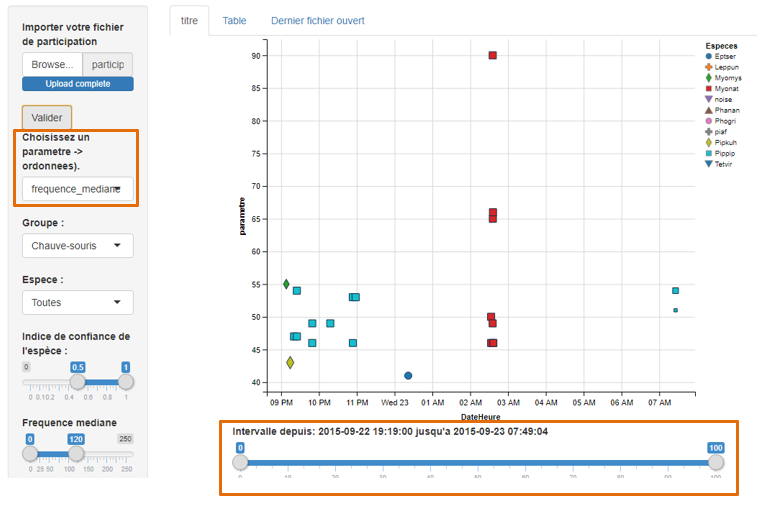
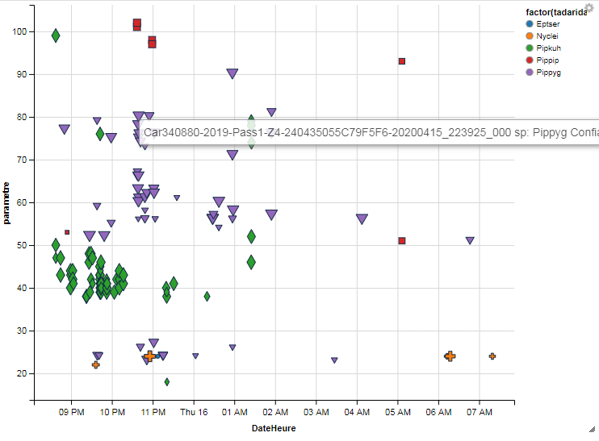

```{r, include = FALSE}
knitr::opts_chunk$set(
  collapse = TRUE,
  comment = "#>"
)
```

## Description
L'application Shiny Vigie-Chiro permet de créer un graphique
  des résultats de participation à Vigie-Chiro afin de valider
  manuellement les identifications proposées par le classificateur
  de TADARIDA.
  
## Prérequis
Vous aurez besoin de préparer :
*	Un fichier .csv d’une de vos participations issu du portail en ligne Vigie-Chiro. Pour rappel, il est nécessaire d’avoir au préalable transféré vos sons sur le portail selon la [procédure habituelle](https://docs.google.com/presentation/d/1Wxk-XVmiGazUPIkSQtmqAKaU2hzlX-V3OhsJIHEORlM/edit#slide=id.g568cc6b041_0_1). Pour rappel il est possible d’obtenir le fichier .csv en suivant ces [instructions](https://docs.google.com/presentation/d/15tnYunXTvN795m3svq-wwSqf1vYNwYI_jYzjLRRf0Qk/edit#slide=id.p).
*	Le dossier des sons de cette participation.

## Lancer l'appli Shiny
Ouvrez RStudio. Dans RStudio, tapez les lignes suivantes dans la Console:

```{r setup}
library(vigie.chiro.app)
```
```{r, eval = FALSE}
vigie.chiro.app::run_app()
```

L’appli Shiny s’ouvre dans une nouvelle fenêtre. Ne fermez pas RStudio.

## Utiliser l’appli Shiny
Vos résultats s’affichent dans l’appli Shiny :


Vous remarquerez que l’axe X montre la date et l’heure de la nuit alors que l’axe Y montre un « paramètre ». Ce paramètre, vous pouvez  <span style="color: orange;">le choisir</span> dans la colonne de gauche. Vous pouvez aussi régler l’affichage de l’axe X grâce au curseur qui se trouve <span style="color: orange;">juste dessous</span>.

Vous avez accès à plusieurs options dans la colonne de gauche (choix du groupe, choix de l’espèce). Vous avez aussi accès à des curseurs que vous pouvez régler à votre guise (Indice de confiance, fréquence médiane).

## Ouvrir un son sur votre ordinateur depuis l’appli Shiny

Vous remarquerez que si vous passez votre curseur sur un point du graphique, des informations s’affichent. Elles affichent le nom du fichier son, l’espèce identifiée par TADARIDA, et l’indice de confiance associé.



Il vous suffit alors de cliquer sur le point pour que le nom du fichier soit copié. Vous pouvez le coller dans le logiciel de votre choix (Syrinx, Batsound, Audacity, Kaleidoscope…) afin de l’analyser plus en détail.

## Corriger manuellement les identifications de TADARIDA 

Une fois que 


  